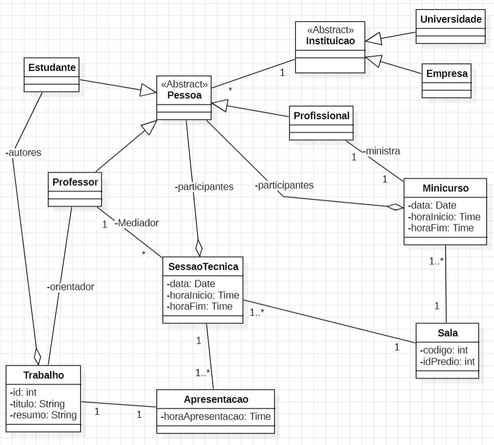

# atividade-sbbd-puc
Valor: 5 pontos        OBS: Esta atividade pode ser feito em duplas

Entrega: XXX, especificado no canvas (23:59)             Formato de Envio: Projeto Java zipado

Entrega em atraso: 15% de desconto na nota por dia de atraso, até a data limite

## Simposio Brasileiro de Banco de Dados

Você foi convidado para participar do projeto de um sistema para gerenciar o Simpósio Brasileiro de Banco de Dados, o SBBD. Dentre as várias tarefas que o SBBD gerencia, você foi contratado para construir parte do sistema cuja responsabilidade é gerenciar as Sessões Técnicas (STs) e Minicursos.

Considere o diagrama UML abaixo como parte inicial da solução. É preciso pensar em atributos e métodos para cada classe modelada. Os atributos já considerados devem ser utilizados na solução.

Todo o sistema será gerenciado, a princípio, em memória principal. Desta forma, em seu sistema, utilize classes auxiliares para manter as coleções de objetos. Por exemplo,  utilize uma classe Professores para manter uma coleção de Professor, e os métodos necessários para incluir, editar, excluir, pesquisar e etc. As classes de coleção devem implementar o padrão de projeto Singleton.

